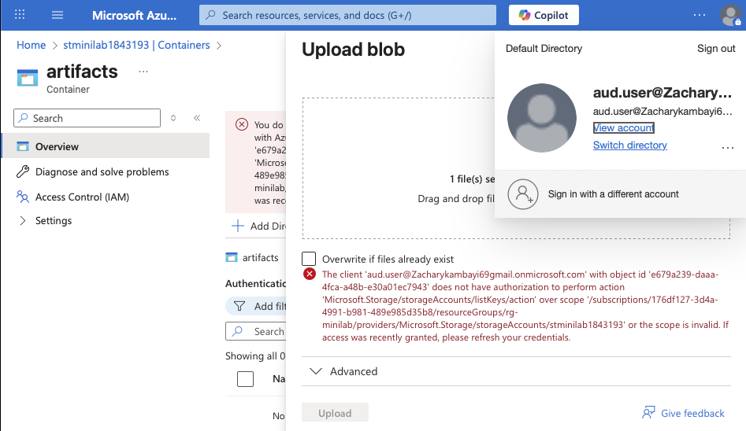

# Azure Security Monitoring & RBAC Lab

A hands-on mini-lab that:
- Applies least-privilege access with **Azure RBAC**
- Simulates an insecure change (**public blob access**)
- Detects it with **Azure Monitor alerts** (email + dashboard)
- Remediates by **disabling anonymous blob access** and verifies the block

## What you’ll see
- RBAC assignments at RG scope (Owner / Contributor / Reader)
- Admin first-login password update flow
- Developer can read blobs; Auditor is blocked from uploads
- Activity Log alert for public access change (12 events fired in test)
- Email notification and remediation proof (public access blocked)

---

## Steps Walkthrough

### Step 1 – Configure RBAC Assignments
Owner, Contributor, and Reader roles applied at the resource group (`rg-minilab`) scope.  

---

### Step 2 – Admin First Login
Admin account prompted to reset password on first sign-in.  

---

### Step 3 – Developer Access
Developer account (`dev.user`) accessing the blob container and successfully reading blobs.  

---

### Step 4 – Auditor Restrictions
Auditor account (`aud.user`) attempting to upload a blob, blocked due to RBAC Reader role.  

---

### Step 5 – Azure Monitor Alerts Fired
Azure Monitor detects blob access configuration changes and triggers multiple alerts.  

---

### Step 6 – Email Notification
Email received confirming the alert `Detect-Public-Blob-AccessChange` was activated.  

---

### Step 7 – Remediation Proof
Attempting to enable public access results in failure – proving that anonymous blob access is blocked.  

---

## Key Takeaways
- **Least privilege** enforced using RBAC roles.
- **Alert rules** detect sensitive configuration changes in real-time.
- **Email notifications** ensure visibility of incidents.
- **Remediation** (public access disabled) validated and proven.

---
